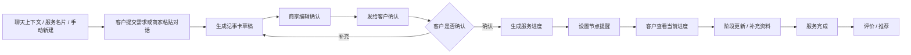

# 《记事卡》MVP 第一版小程序场景

## 1. 第一版定位

《记事卡》第一版不做完整 CRM，也不做交付、报价、合同和收款。

它只解决一个核心问题：

> 把微信里的客户事项，变成一张双方可确认、可提醒、可跟进的卡。

第一版验证的不是“客户管理系统是否完整”，而是：

- 商家是否愿意把客户沟通整理成卡；
- 客户是否愿意打开卡片确认需求；
- 这张卡是否能推动下一步服务进度；
- 提醒是否真的能减少遗忘和反复沟通。

## 2. MVP 核心用户

### 商家端

第一版优先服务：

- 小老板；
- 项目经理；
- 私域运营；
- 顾问型销售；
- 服务型商家。

他们的共同点是：

- 客户主要来自微信私聊或微信群；
- 已经有初步意向，不是冷线索；
- 需要反复确认需求、时间、资料和进度；
- 不想上重型 CRM，但需要一个轻量跟进工具。

### 客户端

客户不是后台用户，只是服务参与方。

客户只需要看到：

- 当前要确认什么；
- 当前要补充什么；
- 当前服务进展到哪；
- 下一步需要谁做什么。

客户不需要看到完整 CRM、全部项目后台、会员页和商家内部备注。

## 3. 第一版核心场景

### 场景 0：从对话上下文唤起记录

这是《记事卡》第一版最重要的高频入口之一。

用户不是先想到“我要打开一个 CRM”，而是在微信沟通中突然意识到：

> 这事得记下来、确认一下、后面还要跟。

适用时机：

- 私聊里客户提出需求；
- 群聊里讨论出待办；
- 客户发来一段语音、截图或长消息；
- 商家和客户约了时间；
- 某个节点需要客户确认；
- 微信 AI 或微信搜索理解到“记录/跟进/确认”意图。

第一版入口：

```text
从聊天整理

你可以粘贴一段微信聊天、需求描述或群聊摘要。

[粘贴聊天内容]
[上传截图]
[录入语音摘要]

整理成：
[需求确认卡]
[服务进度卡]
[群聊待办]
[预约记录]
```

生成结果：

```text
已从对话中整理出：

客户：王女士
事项：企业官网改版咨询
关键信息：
- 需要移动端适配
- 希望 6 月底前上线
- 需要看案例

建议下一步：
发需求确认卡给客户

[编辑]
[保存为记事卡]
[发给客户确认]
```

MVP 重点：

- 第一版不自动读取微信聊天记录；
- 由用户主动粘贴、上传截图、录入摘要或通过分享入口带入上下文；
- AI 只整理草稿，不直接保存为最终确认内容；
- 商家必须编辑或确认后才能发给客户；
- 客户侧只看到整理后的确认卡，不看到商家内部判断。

后期可增强：

- 微信 AI 识别聊天意图后唤起「记事卡」；
- 自动带入用户授权的对话摘要；
- 根据上下文推荐卡片类型；
- 群聊中识别待办并绑定到已有客户或项目；
- 通过自然语言创建提醒，例如“明天下午提醒我问客户资料”。

### 场景 1：商家把服务名片发给客户

适用时机：

- 刚加微信；
- 客户初步咨询；
- 群里有人问“你是做什么的”；
- 老客户转介绍新客户。

商家动作：

1. 打开「我的服务名片」；
2. 选择或编辑服务介绍；
3. 分享给客户或群聊。

客户看到：

```text
张三
品牌设计顾问

可协助：
- 官网设计
- 品牌梳理
- 宣传物料

[说说你的需求]
[预约沟通]
[保存联系方式]
```

MVP 重点：

- 名片不是静态电子名片；
- 名片是需求入口；
- 客户点击后直接进入需求登记。

### 场景 2：客户提交需求并留下手机号

适用时机：

- 客户点开服务名片；
- 商家发来需求登记卡；
- 老客户想发起新需求；
- 群聊里确认需要单独跟进。

客户填写：

- 姓名或称呼；
- 手机号；
- 需求描述；
- 期望时间；
- 可选补充图片或文件；
- 是否需要预约沟通。

手机号用途：

- 作为客户唯一 ID；
- 关联客户历史需求；
- 支持同一客户多个项目；
- 后期支持会员状态和外部数据导入。

MVP 重点：

- 第一版必须收手机号；
- 可先用手机号验证码或微信授权手机号；
- 不做复杂客户档案，只做基础识别。

### 场景 3：商家整理需求并生成「需求确认卡」

适用时机：

- 客户提交了初步需求；
- 商家从私聊或群聊里复制了一段沟通内容；
- 客户说得比较散，需要整理成确认内容。

商家端页面：

```text
需求确认卡草稿

客户：王女士
手机号：138****1234
需求：企业官网改版
重点：
- 希望提升品牌感
- 需要移动端适配
- 期望 6 月底上线

待确认：
- 是否包含文案？
- 是否需要多语言？
- 是否已有参考网站？

[编辑]
[发给客户确认]
```

第一版处理：

- 支持商家手动创建；
- 支持粘贴聊天内容后辅助整理；
- AI 可作为增强能力，但不能成为唯一主路径；
- 商家确认后才能发给客户。

MVP 重点：

- 核心不是自动化程度，而是双方确认；
- 需求卡必须可编辑；
- 不能让 AI 直接替商家确认。

### 场景 4：客户确认需求或补充信息

适用时机：

- 商家发出需求确认卡；
- 客户需要确认商家理解是否准确；
- 客户需要补充资料、时间或说明。

客户看到：

```text
请确认你的需求

目前理解：
1. 企业官网改版
2. 需要移动端适配
3. 希望 6 月底前上线

还需要确认：
- 是否包含文案？
- 是否需要多语言？

[确认无误]
[我要补充]
```

客户动作：

- 确认无误；
- 修改或补充；
- 上传轻量资料；
- 预约沟通时间。

MVP 重点：

- 客户只看到当前阶段该看的内容；
- 不展示商家内部备注；
- 不展示完整项目后台。

### 场景 5：生成服务进度并设置节点提醒

适用时机：

- 客户确认需求后；
- 商家需要进入后续服务推进；
- 双方需要知道当前到哪一步。

商家设置：

```text
服务进度

当前项目：企业官网改版

节点：
1. 需求确认 已完成
2. 资料补充 待客户上传
3. 初稿沟通 6 月 20 日
4. 修改确认 待定
5. 服务完成 待定

[设置提醒]
[发给客户]
```

客户看到：

```text
服务进度

当前进展：资料补充
需要你完成：上传品牌资料和参考网站

[上传资料]
[联系商家]
```

MVP 重点：

- 不做交付物管理；
- 不做甘特图；
- 只做节点、状态、提醒；
- 客户只看当前节点和下一步。

### 场景 6：群聊待办绑定到记事卡

适用时机：

- 项目已在群里讨论；
- 老板或负责人已经私下确定，工作人员在群里推进；
- 群里直接产生新的需求或待办。

第一版做法：

- 商家手动创建群聊待办；
- 可粘贴群聊摘要；
- 待办绑定到某张记事卡或某个客户；
- 不做群成员复杂权限和认领系统。

商家端字段：

```text
群聊待办

关联：王女士 / 企业官网改版
事项：客户需补充品牌资料
负责人：商家自己 / 手动备注
截止时间：明天 18:00
提醒：开启
```

MVP 重点：

- 群聊待办是补充能力；
- 不作为第一版主流程；
- 只验证“群里产生的事能不能回到客户进度里”。

### 场景 7：服务完成后评价与推荐

适用时机：

- 服务节点完成；
- 商家手动标记服务结束；
- 客户确认当前服务已完成。

客户看到：

```text
服务已完成

感谢确认本次服务。

[评价本次服务]
[推荐给朋友]
```

商家获得：

- 客户评价；
- 是否愿意推荐；
- 客户后续服务状态；
- 后期会员状态沉淀。

MVP 重点：

- 评价只做轻量；
- 推荐以分享卡片或海报为主；
- 不露出会员页。

## 4. 第一版信息架构

### 商家端

```text
首页 / 今日待办
  ├─ 待客户确认
  ├─ 今日提醒
  ├─ 最近记事卡
  ├─ 从聊天整理
  └─ 新建记事卡

记事卡列表
  ├─ 需求待确认
  ├─ 进行中
  ├─ 待客户补充
  └─ 已完成

记事卡详情
  ├─ 客户信息
  ├─ 需求确认
  ├─ 服务进度
  ├─ 提醒节点
  ├─ 群聊待办
  └─ 分享给客户

从聊天整理
  ├─ 粘贴聊天内容
  ├─ 上传截图
  ├─ 录入语音摘要
  ├─ 选择整理类型
  └─ 生成记事卡草稿

我的服务名片
  ├─ 服务介绍
  ├─ 需求入口
  └─ 分享卡片 / 海报
```

### 客户端

客户侧不做完整首页，优先通过分享卡片进入。

```text
服务名片页
  ├─ 查看服务介绍
  ├─ 提交需求
  └─ 预约沟通

需求确认页
  ├─ 查看整理后的需求
  ├─ 确认无误
  ├─ 我要补充
  └─ 补充资料

服务进度页
  ├─ 当前节点
  ├─ 当前需要做什么
  ├─ 联系商家
  └─ 查看历史确认

完成评价页
  ├─ 评价服务
  └─ 推荐给朋友
```

## 5. 第一版必须做

| 模块 | 是否必须 | 说明 |
|---|---:|---|
| 对话上下文记录 | 是 | 从聊天内容整理成记事卡草稿 |
| 服务名片 | 是 | 获客和需求入口 |
| 需求提交 | 是 | 客户主动说明需求 |
| 手机号唯一 ID | 是 | 客户识别主键 |
| 需求确认卡 | 是 | MVP 核心 |
| 客户确认/补充 | 是 | 双端协作核心 |
| 服务进度节点 | 是 | 需求确认后的下一步 |
| 节点提醒 | 是 | 提升工具价值 |
| 分享给客户 | 是 | 微信生态传播和协作 |
| 群聊待办绑定 | 轻量做 | 不做复杂协作 |
| 评价推荐 | 轻量做 | 闭环和传播 |

## 6. 第一版先不做

| 功能 | 第一版处理 |
|---|---|
| 正式报价 | 不做 |
| 方案交付 | 不做 |
| 合同签署 | 不做 |
| 收款支付 | 不做 |
| 发票 | 不做 |
| 完整 CRM 漏斗 | 不做 |
| 客户公海/销售阶段 | 不做 |
| 团队权限 | 后置 |
| 群成员认领任务 | 后置 |
| 腾讯会议自动创建 | 后置 |
| 复杂资料库 | 后置 |
| 会员页 | 不露出 |
| 会员营销 | 后置，只保留后台状态 |
| 自动读取微信聊天 | 不做，先用用户主动粘贴、上传、分享或表单 |

## 7. 第一版核心数据对象

### 客户

- 姓名/称呼；
- 手机号；
- 微信昵称；
- 来源；
- 会员状态；
- 历史记事卡。

### 记事卡

- 卡片类型：需求确认 / 服务进度 / 群聊待办 / 预约沟通；
- 关联客户；
- 关联项目；
- 来源上下文：手动创建 / 名片提交 / 聊天粘贴 / 截图上传 / 群聊摘要 / AI 唤起；
- 当前状态；
- 下一步；
- 提醒时间；
- 客户可见内容；
- 商家内部备注。

### 项目

第一版项目要轻，不做复杂项目管理。

- 项目名称；
- 关联客户；
- 关联多个记事卡；
- 当前服务阶段；
- 完成状态。

### 提醒

- 提醒对象；
- 提醒时间；
- 提醒内容；
- 关联记事卡；
- 是否完成。

## 8. 第一版主流程



## 9. 第一版首页建议

商家端首页不要做大而全仪表盘，先做“今天该跟什么”。

```text
记事卡

今天有 3 件事要跟

待客户确认
- 王女士｜官网改版需求确认

今日提醒
- 16:00 提醒李总补充资料
- 明天前更新张总服务进度

最近记事卡
- 企业官网改版｜进行中
- 品牌物料设计｜待确认

[新建记事卡]
[从聊天整理]
[分享服务名片]
```

## 10. 第一版成功标准

MVP 不先看功能完整度，而看这几个指标：

- 商家是否愿意创建第一张记事卡；
- 商家是否愿意从聊天上下文生成草稿；
- 客户是否愿意打开并确认；
- 客户补充率是否高于普通微信追问；
- 商家是否会为同一客户创建第二张卡；
- 节点提醒是否带来真实回访；
- 服务完成后是否愿意分享名片或推荐。

## 11. 推荐第一版口径

小程序介绍：

> 把微信里的客户需求、确认事项和服务进度整理成卡片，方便双方确认、提醒和持续跟进。

服务内容备注：

> 本小程序为办公工具类服务，主要用于客户沟通事项记录、需求内容整理、服务进度跟踪、节点提醒和双方确认。仅提供信息记录与协同管理功能，不涉及交易撮合、合同签署、收付款、营销推广或即时通信服务。
