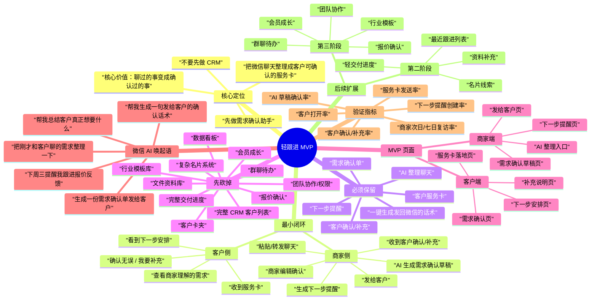

# 《轻跟进》MVP 思维导图

```mermaid
mindmap
  root((轻跟进 MVP))
    核心定位
      "不要先做 CRM"
      "先做需求确认助手"
      "把微信聊天整理成客户可确认的服务卡"
      "核心价值：聊过的事变成确认过的事"

    最小闭环
      商家侧
        "粘贴/转发聊天"
        "AI 生成需求确认草稿"
        "商家编辑确认"
        "发给客户"
        "收到客户确认/补充"
        "生成下一步提醒"
      客户侧
        "收到服务卡"
        "查看商家理解的需求"
        "确认无误 / 我要补充"
        "看到下一步安排"

    必须保留
      "AI 整理聊天"
      "需求确认单"
      "客户服务卡"
      "客户确认/补充"
      "下一步提醒"
      "一键生成发回微信的话术"

    先砍掉
      "完整 CRM 客户列表"
      "会员成长"
      "复杂名片系统"
      "群聊待办"
      "报价确认"
      "完整交付进度"
      "团队协作/权限"
      "数据看板"
      "行业模板库"
      "客户卡夹"
      "文件资料库"

    MVP 页面
      商家端
        "AI 整理入口"
        "需求确认草稿页"
        "发给客户页"
        "下一步提醒页"
      客户端
        "服务卡落地页"
        "需求确认页"
        "补充说明页"
        "下一步安排页"

    微信 AI 唤起语
      "把刚才和客户聊的需求整理一下"
      "生成一份需求确认单发给客户"
      "帮我总结客户真正想要什么"
      "下周三提醒我跟进报价反馈"
      "帮我生成一句发给客户的确认话术"

    验证指标
      "AI 草稿确认率"
      "服务卡发送率"
      "客户打开率"
      "客户确认/补充率"
      "下一步提醒创建率"
      "商家次日/七日复访率"

    后续扩展
      第二阶段
        "最近跟进列表"
        "名片线索"
        "轻交付进度"
        "资料补充"
      第三阶段
        "群聊待办"
        "会员成长"
        "报价确认"
        "团队协作"
        "行业模板"
```

