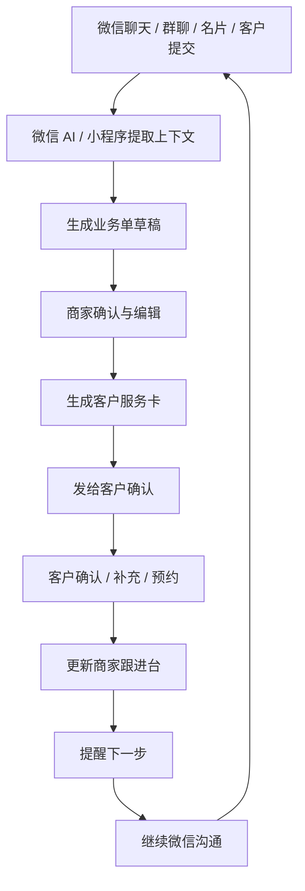

# 《轻跟进》双端产品文档

## 1. 产品定位

《轻跟进》是一款面向微信生态的双端业务跟进小程序。

它面向商家、销售、客服、顾问、项目经理、私域运营等角色，把微信聊天里的客户、需求、待办、交付、会员上下文整理成可执行的业务单；同时给客户生成一张清晰、可确认、可补充、可追踪的服务卡。

一句话定位：

> 把微信聊天里的客户、需求和待办，整理成双方都能继续推进的下一步。

核心不是做一个传统 CRM，而是在微信沟通之后，帮助双方把“聊过的事”变成“确认过的事”。

## 2. 产品判断

### 2.1 为什么适合微信 AI

微信 AI 更容易唤起的是“明确任务”，不是“打开某个产品”。

这些任务天然发生在微信里：

- `把刚才和客户聊的需求整理一下。`
- `把群里刚才说的事整理成待办。`
- `帮我生成一份需求确认单发给客户。`
- `下周三提醒我跟进报价。`
- `把这个会员的偏好和最近互动总结一下。`
- `帮我发一张适合这个客户的名片。`

《轻跟进》要承接的不是泛办公需求，而是微信沟通后的业务整理、确认、提醒和交付。

### 2.2 为什么要做双端

单边 CRM 的问题是：商家记录了很多，但客户无感；客户也不知道需求是否被理解、下一步是什么。

双端模式的优势是：

- 商家端看到客户、需求、待办、交付和会员成长；
- 客户端看到需求确认、报价确认、服务进度、资料补充和会员权益；
- 双方围绕同一张业务卡协作，减少反复解释；
- 客户确认动作本身会提高商家的数据质量。

产品结构：

| 角色 | 看到的产品 | 价值 |
|---|---|---|
| 商家/销售/服务方 | 跟进台 | 整理客户、推进事项、提醒下一步 |
| 客户/会员/合作方 | 服务卡 | 确认需求、补充资料、查看进度 |

## 3. 目标用户

### 3.1 核心商家用户

第一阶段更适合服务型和项目型业务：

- 咨询顾问；
- 企业服务销售；
- 设计、装修、摄影、婚庆等服务商；
- 教育培训顾问；
- 医美、口腔、健康管理顾问；
- 财税、法务、人力外包；
- 私域运营和会员制门店；
- 小老板、自由职业者、项目制团队。

他们的共同痛点：

- 客户信息散在微信聊天里；
- 聊完没有人整理；
- 需求边界不清；
- 报价和交付容易反复；
- 跟进时间靠脑子记；
- 客户确认和补充信息效率低。

### 3.2 客户侧用户

客户侧不是“CRM 用户”，而是某个服务的接受者。

他们关心：

- 商家有没有理解我的需求；
- 下一步是什么；
- 我需要补充什么；
- 报价、方案、进度到哪了；
- 我有哪些权益；
- 我能不能少重复解释。

## 4. 核心场景

### 4.1 客户跟进 / CRM

商家端：

- 从聊天提取客户需求；
- 保存客户档案；
- 记录最近沟通；
- 设置下次跟进；
- 生成下一句话；
- 标记意向、顾虑和机会。

客户侧：

- 查看“我的咨询记录”；
- 确认商家理解是否准确；
- 补充需求；
- 预约下一次沟通。

适合微信 AI 唤起：

- `把这个客户加入跟进。`
- `总结一下客户需求。`
- `提醒我下周三问他报价反馈。`

### 4.2 群聊待办 / 待办

商家端：

- 从群聊提取事项；
- 列出负责人、截止时间、未确认问题；
- 一键生成发回群里的总结；
- 跟踪完成状态。

成员/客户侧：

- 查看自己负责什么；
- 确认或拒绝认领；
- 补充说明；
- 标记完成。

适合微信 AI 唤起：

- `把群里刚才说的事整理成待办。`
- `谁负责什么，帮我列一下。`
- `生成一版发回群里的总结。`

### 4.3 需求交付 / 需求分析整理

商家端：

- 将客户表达整理成需求分析单；
- 区分背景、目标、功能、非功能、交付物、时间节点；
- 生成待确认问题；
- 形成交付计划。

客户侧：

- 查看需求确认卡；
- 修改需求描述；
- 补充资料；
- 确认优先级；
- 查看交付进度。

适合微信 AI 唤起：

- `把客户这段话整理成需求文档。`
- `提取客户真正想要的功能。`
- `生成一份需求确认单发给客户。`

### 4.4 会员成长

商家端：

- 查看会员档案；
- 总结消费和互动；
- 记录偏好；
- 推荐下一次触达动作；
- 发送权益或活动。

会员侧：

- 查看当前等级；
- 查看权益；
- 完成成长任务；
- 预约服务；
- 接收专属推荐。

适合微信 AI 唤起：

- `这个会员适合推什么活动？`
- `帮我总结这个会员的偏好。`
- `给这个会员生成一条关怀话术。`

### 4.5 名片分享

商家端：

- 生成场景化名片；
- 记录客户访问；
- 接收客户提交的需求；
- 自动生成跟进提醒。

客户侧：

- 看商家是谁；
- 看服务范围和案例；
- 留需求；
- 预约沟通；
- 交换名片。

适合微信 AI 唤起：

- `帮我发一张适合这个客户的名片。`
- `根据这个场景生成我的自我介绍。`
- `客户点了名片后帮我生成跟进提醒。`

## 5. 产品核心对象

### 5.1 业务单

业务单是商家端的核心对象。

类型包括：

- 客户跟进单；
- 群聊待办单；
- 需求确认单；
- 交付进度单；
- 会员档案单；
- 名片线索单。

字段示例：

| 字段 | 说明 |
|---|---|
| 来源 | 聊天、群聊、名片、客户提交、手动创建 |
| 对象 | 客户、会员、群成员、合作方 |
| 摘要 | AI 提取的核心信息 |
| 下一步 | 下一次需要做什么 |
| 负责人 | 商家内部负责人 |
| 截止时间 | 何时完成 |
| 客户待确认 | 客户需要确认或补充的内容 |
| 状态 | 待确认 / 跟进中 / 交付中 / 已完成 |

### 5.2 服务卡

服务卡是客户侧的核心对象。

客户看到的是：

- 需求确认；
- 报价确认；
- 进度追踪；
- 资料补充；
- 预约安排；
- 会员权益；
- 售后进度。

客户看不到：

- 意向等级；
- 商家内部备注；
- 销售话术；
- 价格底线；
- 内部风险判断；
- 高价值/低价值标签。

## 6. 核心闭环



核心原则：

- AI 负责提取和生成草稿；
- 商家负责确认和发送；
- 客户负责确认、补充和查看；
- 小程序负责保存上下文、提醒下一步。

## 7. 双端产品结构

### 7.1 商家端：跟进台

主要页面：

- 今日待办；
- 客户；
- 需求；
- 交付；
- 会员；
- 名片；
- AI 整理入口；
- 模板设置。

商家端关键动作：

- 创建业务单；
- 从聊天生成业务单；
- 编辑 AI 提取内容；
- 发服务卡给客户；
- 设置提醒；
- 标记状态；
- 一键生成发回微信的话术。

### 7.2 客户端：我的服务卡

主要页面：

- 待确认；
- 进行中；
- 已完成；
- 我的资料；
- 我的权益；
- 预约；
- 联系商家。

客户侧关键动作：

- 确认需求；
- 补充资料；
- 确认报价；
- 查看进度；
- 预约沟通；
- 留下反馈；
- 查看会员权益。

## 8. 微信 AI 接入设计

### 8.1 推荐接入能力

产品应准备可被微信 AI 调用的任务：

| 能力 | 入参 | 输出 |
|---|---|---|
| 生成客户跟进单 | 聊天摘要、客户信息 | 客户跟进单草稿 |
| 生成群聊待办 | 群聊内容、成员信息 | 待办列表 |
| 生成需求确认单 | 客户描述、附件 | 需求确认卡 |
| 生成交付进度卡 | 项目状态 | 客户进度页 |
| 生成会员触达建议 | 会员档案、消费记录 | 推荐动作和话术 |
| 生成场景化名片 | 商家资料、客户场景 | 名片分享页 |

### 8.2 入口路径建议

```text
pages/ai/create?type=followup
pages/ai/create?type=todo
pages/ai/create?type=requirement
pages/ai/create?type=delivery
pages/ai/create?type=member
pages/share/service-card?id={serviceCardId}
pages/share/business-card?id={cardId}
```

### 8.3 关键兜底

不能假设微信 AI 永远能直接读取完整聊天。

需要提供这些输入方式：

- 选择或转发聊天内容；
- 粘贴聊天；
- 上传聊天截图；
- 上传语音或文件；
- 客户主动填写表单；
- 商家手动补充。

## 9. MVP 范围

第一版建议只做三个核心业务单：

1. 客户跟进单；
2. 群聊待办单；
3. 需求确认单。

第一版客户端只做三种服务卡：

1. 需求确认卡；
2. 进度追踪卡；
3. 资料补充卡。

名片分享可以作为获客入口做轻版本；会员成长放到第二阶段。

### 9.1 MVP 必做

- 商家注册和基础资料；
- 客户跟进台；
- AI 整理草稿；
- 手动编辑和确认；
- 服务卡生成；
- 客户确认/补充；
- 提醒；
- 一键生成发回微信的总结；
- 基础权限和隐私控制。

### 9.2 暂不做

- 完整企业 CRM；
- 复杂销售漏斗；
- 多级组织权限；
- 财务、合同、发票深度管理；
- 大型项目管理；
- 行业全模板库；
- 完整会员营销自动化。

## 10. 商业化方向

### 10.1 前期

适合采用商家订阅或用量包：

- 免费版：少量业务单、少量服务卡；
- 专业版：更多客户、提醒、模板、AI 整理次数；
- 团队版：多人协作、权限、客户分配；
- 行业版：模板包和更强的服务卡。

### 10.2 可收费能力

- AI 整理次数；
- 服务卡数量；
- 客户容量；
- 短信/微信提醒增强；
- 行业模板；
- 团队协作；
- 数据导出；
- 自定义品牌名片；
- 会员成长模块。

## 11. 核心指标

| 指标 | 说明 |
|---|---|
| AI 生成业务单数 | 用户是否真的用它整理聊天 |
| 草稿确认率 | AI 生成内容是否可用 |
| 服务卡发送率 | 商家是否愿意发给客户 |
| 客户打开率 | 客户侧页面是否有吸引力 |
| 客户确认率 | 客户是否愿意补充/确认 |
| 待办完成率 | 是否推动实际执行 |
| 跟进提醒触达率 | 是否形成复访 |
| 付费商家转化率 | 商业化能力 |

## 12. 风险与边界

### 12.1 隐私风险

- 商家内部备注不能展示给客户；
- 客户确认前不能把敏感资料公开给多人；
- 聊天内容提取应明确授权；
- 服务卡应支持撤回和失效；
- 客户可申请删除自己的资料。

### 12.2 AI 误读风险

- AI 生成内容必须是草稿；
- 商家发送前必须确认；
- 客户侧要允许修改和补充；
- 关键报价、交付范围、合同条款不能只靠 AI 自动确认。

### 12.3 产品边界

《轻跟进》不是完整 CRM，也不是项目管理系统。

第一阶段只解决：

> 微信里聊过的业务信息，如何被整理成双方都能继续推进的下一步。
