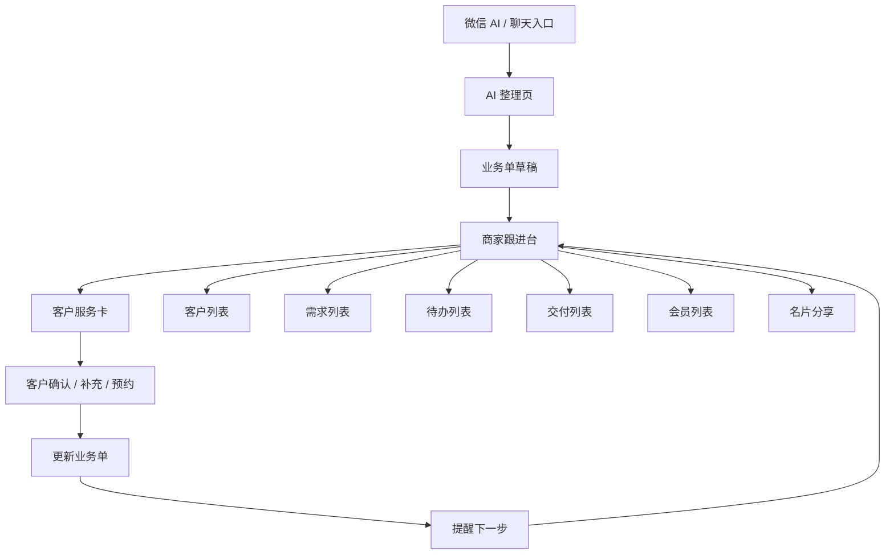
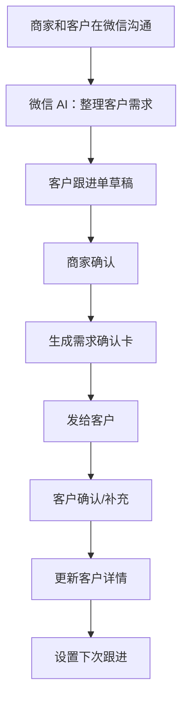
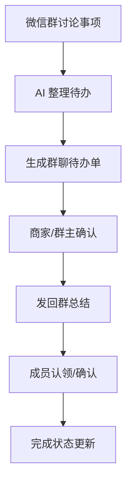
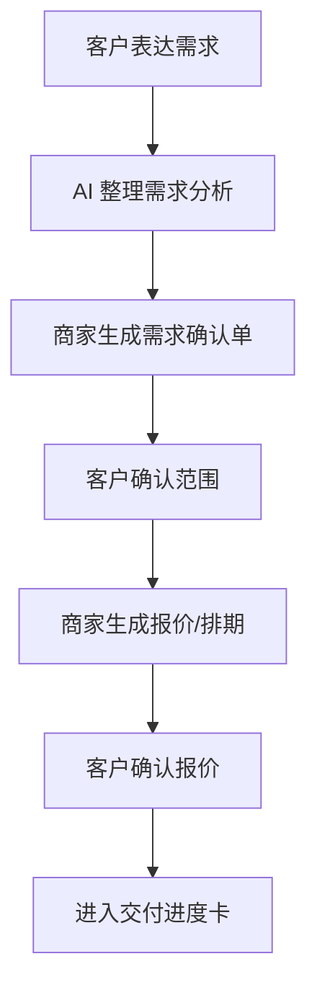

# 《轻跟进》双端原型图说明

## 1. 原型目标

本原型用于表达《轻跟进》的双端使用方式：

- 商家端：把微信沟通整理成可跟进的业务单；
- 客户端：通过服务卡确认需求、补充信息、查看进度；
- 微信 AI：作为自然语言入口，帮助用户生成业务单草稿。

核心验证：

- 商家是否愿意把聊天整理成业务单；
- 商家是否愿意把服务卡发给客户；
- 客户是否愿意打开服务卡并确认/补充；
- 业务单是否能推动下一步跟进。

## 2. 总体信息架构



## 3. 商家端页面

### B1 今日跟进台

用途：商家每天打开后的工作首页。

页面结构：

```text
┌────────────────────────┐
│  轻跟进                 │
│  今天有 7 件事要推进     │
│                        │
│  [AI 整理聊天]           │
│                        │
│  今日待办                │
│  - 10:00 跟进王总报价    │
│  - 14:00 发需求确认单    │
│  - 明天前确认交付排期    │
│                        │
│  最近客户                │
│  [王总｜高意向｜待报价]  │
│  [李女士｜待补资料]      │
│                        │
│  [客户] [需求] [待办]    │
└────────────────────────┘
```

关键模块：

- 今日待办；
- 最近客户；
- 待客户确认；
- AI 整理入口；
- 快捷创建。

设计重点：

- 不做传统 CRM 仪表盘；
- 先让用户看到“今天下一步”；
- 首页要像工作清单，不像管理后台。

### B2 AI 整理聊天页

用途：承接微信 AI 或用户手动粘贴内容。

页面结构：

```text
┌────────────────────────┐
│  整理成什么？            │
│                        │
│  [客户跟进单]            │
│  [群聊待办单]            │
│  [需求确认单]            │
│  [交付进度卡]            │
│                        │
│  聊天内容                │
│  [粘贴 / 上传截图 / 语音]│
│                        │
│  [开始整理]              │
└────────────────────────┘
```

入口来源：

- 微信 AI 调用；
- 商家主动点击；
- 名片线索；
- 客户提交表单；
- 群聊待办入口。

状态：

- 空状态；
- 生成中；
- 草稿成功；
- 需要补充信息；
- 解析失败。

### B3 业务单草稿页

用途：AI 生成后的商家确认页。

页面结构：

```text
┌────────────────────────┐
│  客户跟进单草稿          │
│                        │
│  客户：王总              │
│  需求：企业官网改版      │
│  预算：待确认            │
│  顾虑：上线时间较紧      │
│                        │
│  下一步：发需求确认单    │
│  跟进时间：周三 10:00    │
│                        │
│  [编辑] [保存]           │
│  [生成客户服务卡]        │
└────────────────────────┘
```

设计重点：

- 明确提示“AI 草稿，发送前请确认”；
- 所有字段可编辑；
- 商家确认后才能发给客户；
- 可以一键生成服务卡。

### B4 客户详情页

用途：商家查看客户上下文。

页面结构：

```text
┌────────────────────────┐
│  王总                   │
│  企业官网改版｜高意向    │
│                        │
│  下一步                 │
│  周三 10:00 跟进报价反馈 │
│                        │
│  最近沟通摘要            │
│  关注上线时间和案例质量  │
│                        │
│  业务单                 │
│  [需求确认单｜待客户确认]│
│  [报价单｜未发送]        │
│                        │
│  [生成下一句话]          │
│  [发服务卡]              │
└────────────────────────┘
```

仅商家可见：

- 意向等级；
- 内部备注；
- 跟进话术；
- 商机判断；
- 内部风险。

### B5 群聊待办单页

用途：把群聊里的事项整理成任务。

页面结构：

```text
┌────────────────────────┐
│  群聊待办单              │
│                        │
│  项目：品牌活动物料      │
│                        │
│  待办                   │
│  □ A 负责海报文案 周三前 │
│  □ B 确认场地 周四前     │
│  □ C 汇总报名名单 今天   │
│                        │
│  未确认问题              │
│  - 预算是否含搭建？      │
│                        │
│  [发回群聊总结]          │
└────────────────────────┘
```

成员侧动作：

- 认领；
- 完成；
- 补充说明；
- 修改截止时间。

### B6 需求确认单页

用途：服务方整理客户需求。

页面结构：

```text
┌────────────────────────┐
│  需求确认单              │
│                        │
│  背景                   │
│  客户希望重做企业官网    │
│                        │
│  目标                   │
│  提升品牌感和线索转化    │
│                        │
│  交付物                 │
│  - 首页设计              │
│  - 产品页模板            │
│  - 移动端适配            │
│                        │
│  待客户确认              │
│  - 是否包含文案？        │
│  - 是否需要多语言？      │
│                        │
│  [发给客户确认]          │
└────────────────────────┘
```

设计重点：

- 把客户模糊表达变成可确认条目；
- 重点突出“待客户确认”；
- 不把内部判断发给客户。

### B7 交付进度页

用途：管理交付状态，并生成客户可见进度。

页面结构：

```text
┌────────────────────────┐
│  企业官网改版            │
│                        │
│  当前阶段：方案设计中    │
│  预计完成：6 月 18 日    │
│                        │
│  商家待办                │
│  □ 输出首页初稿          │
│                        │
│  客户待确认              │
│  □ 确认品牌色            │
│  □ 补充产品资料          │
│                        │
│  [同步客户进度卡]        │
└────────────────────────┘
```

### B8 会员档案页

用途：查看会员上下文和推荐动作。

页面结构：

```text
┌────────────────────────┐
│  李女士                 │
│  金卡会员｜最近到店 12 天前│
│                        │
│  偏好                   │
│  喜欢周末预约，不喜欢推销 │
│                        │
│  最近互动                │
│  询问过年卡续费          │
│                        │
│  推荐动作                │
│  发送一次温和关怀 + 权益提醒│
│                        │
│  [生成关怀话术]          │
│  [发送权益卡]            │
└────────────────────────┘
```

### B9 名片分享页

用途：作为线索入口和轻量获客页。

页面结构：

```text
┌────────────────────────┐
│  我的商务名片            │
│                        │
│  张三｜品牌设计顾问      │
│  服务：官网 / 品牌 / 物料 │
│                        │
│  适合发给这个客户的介绍：│
│  我主要帮企业把品牌和官网 │
│  整理成更清晰的表达。    │
│                        │
│  [发给客户]              │
│  [生成预约链接]          │
└────────────────────────┘
```

## 4. 客户端页面

### C1 服务卡落地页

用途：客户从微信里点开后看到的轻页面。

页面结构：

```text
┌────────────────────────┐
│  你的服务卡              │
│                        │
│  张三为你整理了一份需求  │
│  确认卡。                │
│                        │
│  当前状态：待你确认      │
│                        │
│  [查看并确认]            │
│  [联系商家]              │
└────────────────────────┘
```

设计重点：

- 不出现“CRM”字样；
- 不要求先注册；
- 明确客户要做什么。

### C2 需求确认卡

用途：客户确认商家理解是否准确。

页面结构：

```text
┌────────────────────────┐
│  需求确认               │
│                        │
│  这是目前理解的需求：    │
│                        │
│  1. 企业官网改版         │
│  2. 需要移动端适配       │
│  3. 希望 6 月底前上线    │
│                        │
│  还需要你确认：          │
│  - 是否包含文案？        │
│  - 是否需要多语言？      │
│                        │
│  [确认无误]              │
│  [我要补充]              │
└────────────────────────┘
```

客户动作：

- 确认无误；
- 修改描述；
- 补充资料；
- 留下问题；
- 预约沟通。

### C3 资料补充页

用途：让客户补齐资料，而不是在微信里反复找。

页面结构：

```text
┌────────────────────────┐
│  补充资料                │
│                        │
│  还需要你提供：          │
│  □ 公司 Logo             │
│  □ 产品介绍              │
│  □ 参考网站              │
│                        │
│  [上传文件/图片]         │
│  [先跳过]                │
└────────────────────────┘
```

### C4 报价确认页

用途：客户查看报价要点。

页面结构：

```text
┌────────────────────────┐
│  报价确认                │
│                        │
│  服务内容：企业官网设计  │
│  周期：15 个工作日       │
│  报价：¥XX,XXX           │
│  有效期：7 天            │
│                        │
│  包含                   │
│  - 首页设计              │
│  - 3 个内页模板          │
│                        │
│  不包含                 │
│  - 服务器费用            │
│                        │
│  [确认报价]              │
│  [我有问题]              │
└────────────────────────┘
```

### C5 服务进度卡

用途：客户查看到哪一步了。

页面结构：

```text
┌────────────────────────┐
│  服务进度                │
│                        │
│  企业官网改版            │
│                        │
│  ● 需求已确认            │
│  ● 报价已发送            │
│  ○ 方案设计中            │
│  ○ 初稿确认              │
│  ○ 交付完成              │
│                        │
│  你需要做：              │
│  补充产品介绍资料        │
│                        │
│  [补充资料]              │
│  [联系商家]              │
└────────────────────────┘
```

### C6 我的服务卡夹

用途：客户自己的服务记录入口。

页面结构：

```text
┌────────────────────────┐
│  我的服务                │
│                        │
│  待确认                 │
│  [企业官网改版｜需求确认]│
│                        │
│  进行中                 │
│  [品牌设计｜方案设计中]  │
│                        │
│  已完成                 │
│  [摄影预约｜已完成]      │
└────────────────────────┘
```

### C7 会员权益页

用途：客户查看会员成长和权益。

页面结构：

```text
┌────────────────────────┐
│  我的会员权益            │
│                        │
│  当前等级：金卡          │
│  可用权益：              │
│  - 1 次免费复诊/咨询     │
│  - 生日月专属券          │
│                        │
│  成长任务                │
│  □ 完善偏好              │
│  □ 预约下次服务          │
│                        │
│  [使用权益]              │
└────────────────────────┘
```

### C8 名片接收页

用途：客户点开商家名片后，能快速发起需求。

页面结构：

```text
┌────────────────────────┐
│  张三                   │
│  品牌设计顾问            │
│                        │
│  我能帮你：              │
│  - 官网设计              │
│  - 品牌梳理              │
│  - 宣传物料              │
│                        │
│  [说说你的需求]          │
│  [预约沟通]              │
│  [交换名片]              │
└────────────────────────┘
```

## 5. 关键流程原型

### 5.1 客户跟进流程



### 5.2 群聊待办流程



### 5.3 需求交付流程



## 6. 视觉和交互建议

### 6.1 商家端

气质：

- 清晰；
- 高效；
- 不压迫；
- 像微信里的轻工作台。

布局：

- 列表优先；
- 待办优先；
- 状态清楚；
- AI 草稿和人工确认分层；
- 尽量少用大图和装饰。

关键组件：

- 状态标签；
- 截止时间；
- 负责人；
- 客户待确认；
- 一键发回微信；
- 下一步建议。

### 6.2 客户端

气质：

- 简单；
- 可信；
- 像服务凭证；
- 不像被管理。

布局：

- 一屏说清楚当前状态；
- CTA 明确；
- 少字段；
- 不强制登录；
- 可补充、可确认、可联系。

关键组件：

- 服务状态；
- 待确认问题；
- 补充资料；
- 进度条；
- 联系商家；
- 我的服务记录。

## 7. 原型优先级

第一版建议先画 10 个画板。

商家端 6 个：

1. 今日跟进台；
2. AI 整理聊天页；
3. 业务单草稿页；
4. 客户详情页；
5. 需求确认单页；
6. 群聊待办单页。

客户侧 4 个：

1. 服务卡落地页；
2. 需求确认卡；
3. 服务进度卡；
4. 我的服务卡夹。

第二版再补：

- 会员权益页；
- 名片接收页；
- 报价确认页；
- 资料补充页；
- 交付进度页。

## 8. 原型判断标准

这套原型是否成立，重点看：

- 商家是否能在 30 秒内把聊天整理成业务单；
- 商家是否愿意把服务卡发给客户；
- 客户是否能一眼看懂自己需要确认什么；
- 客户是否愿意补充资料或确认需求；
- 服务卡是否减少微信里反复追问；
- 跟进台是否真的让商家知道下一步该做什么。

如果这些成立，再扩展会员成长、名片分享和更完整的 CRM 能力。
