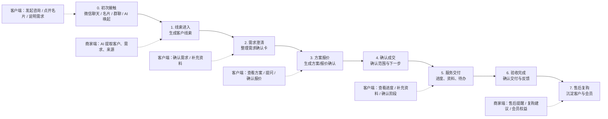
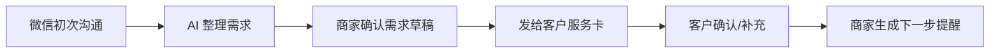

# 《轻跟进》双端服务生命周期梳理

## 1. 核心视角

这不是传统 CRM 的功能清单，而是一条完整服务生命周期：

> 客户第一次咨询商家 -> 商家理解需求 -> 双方确认范围 -> 报价/方案 -> 服务交付 -> 客户验收 -> 售后/复购/会员沉淀。

产品核心对象是一张不断更新的「服务卡」。

商家端看到的是：

> 客户、需求、报价、交付、待办、提醒、复购机会。

客户端看到的是：

> 我的需求、我的确认事项、我的服务进度、我的资料补充、我的验收和售后。

## 2. 双端生命周期总图



## 3. 分阶段双端功能梳理

### 阶段 0：初次接触

场景：

- 客户主动微信咨询；
- 商家发名片；
- 群聊里有人提出需求；
- 微信 AI 根据用户意图推荐或唤起小程序。

客户侧需要：

- 查看商家名片；
- 了解服务范围；
- 快速说明需求；
- 预约沟通；
- 留联系方式；
- 上传一段描述或截图。

商家侧需要：

- 生成场景化名片；
- 识别客户来源；
- 记录客户基础信息；
- 标记客户来自哪个群、哪张名片、哪次聊天；
- 一键生成初次回复话术。

核心产物：

- 名片页；
- 初次咨询记录；
- 线索来源。

适合微信 AI 唤起语：

- `帮我发一张适合这个客户的名片。`
- `把这个客户的咨询记录下来。`
- `根据这段聊天生成一段专业回复。`

### 阶段 1：线索进入

场景：

客户已经表达了初步需求，但还没有形成清晰需求。

客户侧需要：

- 收到“咨询已记录”的轻提示；
- 看到商家理解的大概方向；
- 可以继续补充需求；
- 可以预约进一步沟通。

商家侧需要：

- AI 从聊天中提取客户信息；
- 生成客户线索卡；
- 判断需求类型；
- 标记紧急程度；
- 设置首次跟进提醒；
- 生成下一步沟通建议。

核心产物：

- 客户线索卡；
- 初步需求摘要；
- 首次跟进提醒。

商家端字段：

```text
客户：王总
来源：微信群 / 名片 / 私聊
需求：企业官网改版
紧急程度：较急
下一步：约一次 30 分钟需求沟通
提醒：明天 10:00
```

客户端展示：

```text
你的咨询已记录
商家初步理解：你想了解企业官网改版服务
下一步：补充需求或预约沟通
[补充需求] [预约沟通]
```

### 阶段 2：需求澄清

场景：

这是 MVP 最核心阶段。客户说得模糊，商家需要整理成双方能确认的需求。

客户侧需要：

- 查看需求确认卡；
- 确认哪些理解准确；
- 修改不准确的地方；
- 补充资料；
- 回答待确认问题；
- 保存一份自己也能看的需求记录。

商家侧需要：

- AI 整理聊天内容；
- 生成需求确认单草稿；
- 标出不确定点；
- 商家编辑后发给客户；
- 接收客户补充；
- 更新客户详情。

核心产物：

- 需求确认卡；
- 待确认问题；
- 资料补充清单。

客户端展示：

```text
需求确认

这是目前理解的需求：
1. 企业官网改版
2. 需要移动端适配
3. 希望 6 月底前上线

还需要你确认：
- 是否包含文案？
- 是否需要多语言？

[确认无误] [我要补充]
```

商家端动作：

- 编辑需求；
- 发给客户确认；
- 生成补充资料清单；
- 设置下一步：报价 / 方案 / 沟通。

适合微信 AI 唤起语：

- `把刚才和客户聊的需求整理成确认单。`
- `提取客户真正想要的功能。`
- `列出还需要客户确认的问题。`

### 阶段 3：方案报价

场景：

需求已基本清楚，商家要给方案或报价。

客户侧需要：

- 看清服务包含什么；
- 看清不包含什么；
- 看清价格、周期、有效期；
- 提问；
- 确认或要求调整。

商家侧需要：

- 基于需求生成报价草稿；
- 生成方案摘要；
- 标记报价版本；
- 设置报价有效期；
- 记录客户反馈；
- 设置报价跟进提醒。

核心产物：

- 报价确认页；
- 方案摘要页；
- 报价跟进提醒。

客户端展示：

```text
报价确认

服务内容：企业官网设计
周期：15 个工作日
报价：¥XX,XXX
有效期：7 天

包含：
- 首页设计
- 3 个内页模板

不包含：
- 服务器费用

[确认报价] [我有问题]
```

第一版建议：

- 报价确认可以先后置；
- MVP 只需要保留“下一步：发送方案/报价”的提醒；
- 不要一开始做复杂合同和收款。

### 阶段 4：确认成交

场景：

客户接受服务范围，双方确认进入服务。

客户侧需要：

- 确认最终范围；
- 确认时间节点；
- 确认自己需要配合什么；
- 看到下一步安排。

商家侧需要：

- 将线索转为服务项目；
- 锁定需求范围；
- 创建交付计划；
- 创建客户待办；
- 设置里程碑提醒。

核心产物：

- 服务启动卡；
- 交付计划；
- 客户资料清单。

客户端展示：

```text
服务已开始

当前阶段：资料收集
预计下一步：方案初稿
预计时间：6 月 18 日

你需要提供：
- 公司 Logo
- 产品介绍
- 参考网站

[补充资料] [联系商家]
```

### 阶段 5：服务交付

场景：

服务正在进行，双方需要围绕资料、进度、节点沟通。

客户侧需要：

- 查看当前进度；
- 知道自己是否有待办；
- 补充资料；
- 确认阶段成果；
- 查看预计时间；
- 联系商家。

商家侧需要：

- 管理交付阶段；
- 标记商家待办；
- 标记客户待确认；
- 同步进度给客户；
- 记录沟通摘要；
- 生成进度更新话术。

核心产物：

- 服务进度卡；
- 阶段确认卡；
- 客户待办。

客户端展示：

```text
服务进度

● 需求已确认
● 报价已确认
○ 方案设计中
○ 初稿确认
○ 交付完成

你需要做：
补充产品介绍资料

[补充资料] [联系商家]
```

第一版建议：

- 不做完整项目管理；
- 只做 3-5 个状态；
- 只展示“当前阶段 + 下一步 + 客户待办”。

### 阶段 6：验收完成

场景：

服务交付完成，客户需要确认是否结束。

客户侧需要：

- 查看最终交付；
- 确认完成；
- 提出修改；
- 留评价；
- 保存服务记录。

商家侧需要：

- 发起验收；
- 记录验收结果；
- 记录修改点；
- 标记完成；
- 生成复盘摘要；
- 设置售后提醒。

核心产物：

- 验收确认卡；
- 修改记录；
- 服务复盘。

客户端展示：

```text
交付确认

交付内容：
- 官网首页设计
- 产品页模板
- 移动端适配

[确认完成] [需要修改]
```

### 阶段 7：售后 / 复购 / 会员沉淀

场景：

服务结束后，仍有售后、复购、会员权益、二次转介绍。

客户侧需要：

- 查看历史服务；
- 查看售后入口；
- 使用会员权益；
- 再次发起需求；
- 推荐给朋友。

商家侧需要：

- 售后提醒；
- 复购建议；
- 客户偏好记录；
- 会员成长；
- 二次触达话术；
- 转介绍名片。

核心产物：

- 历史服务卡；
- 售后服务卡；
- 会员权益卡；
- 复购提醒。

客户端展示：

```text
我的服务记录

已完成：
企业官网改版

可用服务：
- 30 天内免费小修改
- 下次服务 9 折

[发起售后] [再次咨询]
```

## 4. 双端功能总览

| 生命周期阶段 | 商家端功能 | 客户端功能 | 共享产物 |
|---|---|---|---|
| 初次接触 | 名片、线索来源、回复话术 | 看名片、提交需求、预约沟通 | 名片页 |
| 线索进入 | 客户线索卡、初步摘要、首次提醒 | 咨询记录、补充需求 | 线索卡 |
| 需求澄清 | AI 需求整理、确认单草稿、待确认问题 | 确认需求、补充资料、修改描述 | 需求确认卡 |
| 方案报价 | 报价草稿、方案摘要、报价提醒 | 查看报价、提问、确认 | 报价确认页 |
| 确认成交 | 服务启动、范围锁定、交付计划 | 确认范围、查看下一步 | 服务启动卡 |
| 服务交付 | 阶段管理、商家待办、客户待确认 | 查看进度、补资料、确认阶段 | 服务进度卡 |
| 验收完成 | 发起验收、记录修改、服务复盘 | 确认完成、提出修改、评价 | 验收确认卡 |
| 售后复购 | 售后提醒、复购建议、会员沉淀 | 查看历史、售后入口、再次咨询 | 历史服务卡 |

## 5. MVP 应该截取哪一段

完整生命周期很长，第一版不应该全做。

最小可验证段：



第一版只做：

- 初次接触；
- 线索进入；
- 需求澄清；
- 下一步提醒。

暂不做：

- 完整报价；
- 完整交付进度；
- 验收；
- 售后；
- 会员成长；
- 复杂名片系统。

## 6. 第一版页面建议

### 商家端 5 个页面

1. AI 整理聊天页；
2. 需求确认草稿页；
3. 客户线索详情页；
4. 发服务卡页；
5. 下一步提醒页。

### 客户端 4 个页面

1. 服务卡落地页；
2. 需求确认页；
3. 补充说明页；
4. 下一步安排页。

## 7. 产品判断标准

这条双端生命周期是否成立，先看最前面的需求确认段：

- 商家是否愿意把聊天整理成需求确认卡；
- 商家是否愿意把服务卡发给客户；
- 客户是否愿意打开；
- 客户是否愿意确认或补充；
- 客户确认后，商家是否觉得后续跟进更清楚。

如果这段成立，再继续往后做报价、交付、验收和售后。

