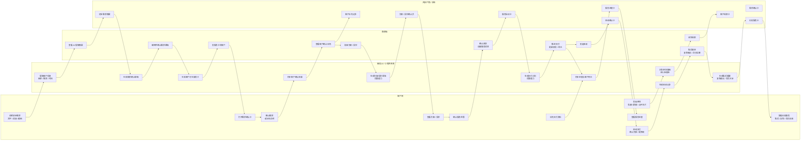
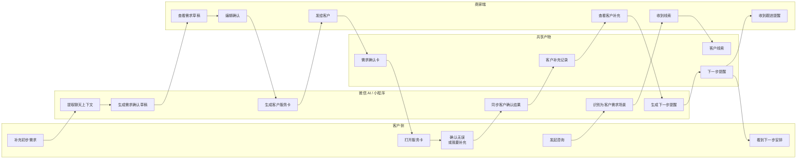

# 《轻跟进》双端服务生命周期泳道图

## 1. 完整生命周期泳道图

## 2. MVP 截取泳道图

第一版建议只截取最前面的需求澄清闭环：

## 3. 第一版页面对应关系

| 阶段 | 商家端页面 | 客户端页面 | 共享产物 |
|---|---|---|---|
| 初次咨询 | 收到线索页 | 名片/咨询入口 | 客户线索 |
| AI 整理 | AI 整理聊天页 | 无 | 需求草稿 |
| 商家确认 | 需求草稿编辑页 | 无 | 需求确认卡 |
| 发给客户 | 发服务卡页 | 服务卡落地页 | 服务卡 |
| 客户确认 | 客户确认结果页 | 需求确认页 / 补充说明页 | 客户补充记录 |
| 下一步 | 下一步提醒页 | 下一步安排页 | 跟进提醒 |

## 4. 第一版边界

第一版不进入完整交付管理，只验证：

- 商家是否愿意让 AI 整理聊天；
- 商家是否愿意确认并发送服务卡；
- 客户是否愿意打开服务卡；
- 客户是否愿意确认或补充；
- 客户确认后，商家是否更清楚下一步。

