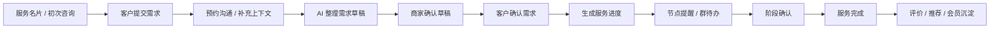

# 《轻跟进》收敛版产品手册

## 1. 新定位

《轻跟进》不是完整 CRM，也不是交付管理系统。

它是一款面向微信生态的双端链路助手，帮助商家和客户把微信里的初步意向，推进到需求确认、服务进度、节点提醒和服务评价。

一句话定位：

> 从客户初步意向，到需求确认，再到服务进度跟踪的微信侧翼助手。

产品只做确认、记录、提醒、进度和客户协作，不在产品内完成正式方案、报价、合同、收款和交付物交付。

## 2. 核心用户

### 2.1 商家端用户

第一版面向：

- 项目经理；
- 小老板；
- 私域运营；
- 服务型商家；
- 顾问型销售；
- 负责客户沟通和项目推进的人。

他们的核心需求不是“管理所有客户”，而是：

- 把有初步意向的客户接住；
- 把聊天里的需求整理清楚；
- 让客户确认需求；
- 跟踪服务进度和节点；
- 提醒自己下一步该做什么；
- 在服务结束后获得评价和推荐。

### 2.2 客户端用户

客户不是 CRM 用户，而是服务的参与方。

他们需要：

- 发起新需求；
- 确认商家是否理解对；
- 补充资料和说明；
- 查看当前服务进度；
- 知道当前自己需要做什么；
- 在结束后评价或推荐给朋友。

客户端不展示完整后台，只展示当前阶段需要客户看到和操作的内容。

## 3. 产品边界

### 3.1 明确保留

| 功能 | 说明 |
|---|---|
| 服务名片 / 需求入口 | 初次见面后发给客户，既介绍自己，也让客户提交需求 |
| 客户需求登记 | 客户可主动发起新需求 |
| 手机号唯一 ID | 需求登记或确认过程中收集手机号，作为后期客户识别主键 |
| AI 需求整理 | 从聊天、表单、截图、语音中生成需求草稿 |
| 客户需求确认 | 整理完需求必须发给客户确认 |
| 服务进度跟踪 | 跟踪服务生命周期中的节点，不承载实际交付物 |
| 节点提醒 | 提醒商家推进、客户确认、资料补充、阶段更新 |
| 群聊待办绑定项目 | 群里讨论的事项可绑定到个人/项目进度 |
| 会议预约 | 可在需求收集前后或项目进行中发起，后期可接入腾讯会议 |
| 多项目/多需求 | 一个手机号可关联多个需求、多个项目，一个项目下可有多个需求 |
| 轻量资料补充 | 用于需求确认或节点确认，不做重型资料库 |
| 会员状态 | 作为后台客户状态和服务策略分层，不单独露出会员页 |
| 服务评价与推荐 | 服务结束后收集评价，引导推荐给朋友 |
| 分享卡片与海报 | 私聊分享服务卡，朋友圈等场景分享海报 |

### 3.2 明确不做

| 功能 | 处理 |
|---|---|
| 正式方案交付 | 不在产品内交付 |
| 正式报价交付 | 不在产品内交付 |
| 合同 | 不做 |
| 收款 | 不做 |
| 发票 | 不做 |
| 复杂项目管理 | 不做甘特图、复杂工时、资源排期 |
| 交付物资料库 | 第一版不做完整文件管理 |
| 完整 CRM 销售漏斗 | 不做重型 CRM |
| 复杂会员营销 | 后置，只保留后台会员状态、权益/服务项差异和外部数据接口方向 |
| 腾讯会议自动预约 | 后置，第一版先做时间收集和会议安排记录 |

## 4. 核心链路



这条链路的核心是：

> 初步意向 -> 需求确认 -> 服务进度 -> 节点提醒 -> 评价推荐。

## 5. 双端生命周期

### 阶段 0：服务名片与初次接触

服务名片不做成静态电子名片，而做成“需求入口型名片”。

客户看到：

```text
张三
品牌设计顾问

我能帮你：
- 官网设计
- 品牌梳理
- 宣传物料

[说说你的需求]
[预约沟通]
[保存联系方式]
```

商家端获得：

- 客户来源；
- 客户手机号；
- 客户初步需求；
- 是否需要跟进；
- 自动生成的线索记录。

保留理由：

- 名片是初次见面后的自然分享抓手；
- 不只是展示身份，而是收集需求；
- 客户提交后直接进入需求确认链路。

### 阶段 1：客户需求登记

客户可以从多种入口进来：

- 服务名片；
- 微信聊天；
- 群聊；
- 商家转发的服务卡；
- 微信 AI 唤起；
- 老客户再次发起新需求。

客户可以在同一个手机号下：

- 发起第一个需求；
- 发起第二个、第三个需求；
- 发起新的项目；
- 在同一个项目下补充多个需求点。

客户需要填写或确认：

- 姓名/称呼；
- 手机号；
- 需求描述；
- 期望时间；
- 可选补充资料；
- 是否愿意被联系。

手机号用途：

- 作为客户唯一 ID；
- 关联历史服务；
- 关联会员数据；
- 关联外部导入数据；
- 避免同一客户重复建档。

数据关系：

```text
客户手机号
  └─ 客户档案
      ├─ 项目 A
      │   ├─ 需求 1
      │   └─ 需求 2
      └─ 项目 B
          └─ 需求 1
```

### 阶段 1.5：预约沟通

预约可以发生在三个阶段：

- 需求收集前：客户先约时间，再沟通需求；
- 需求收集后：商家看完初步需求，约客户补充上下文；
- 项目进行中：围绕某个节点或待确认事项开会。

客户侧：

```text
预约沟通

你可以选择一个方便的时间：
- 今天 16:00
- 明天 10:30
- 后天 15:00

[确认预约]
[换个时间]
```

商家侧：

```text
预约记录

客户：王女士
事项：补充官网改版需求
时间：明天 10:30
关联：企业官网改版 / 需求确认

[发送会议安排]
[设置提醒]
```

第一版处理：

- 支持时间收集；
- 支持记录预约；
- 支持提醒；
- 支持手动填写会议链接。

后期增强：

- 调通腾讯会议自动预约；
- 自动生成会议链接；
- 自动发送给对应人员；
- 群聊场景下自动同步给相关成员。

### 阶段 2：AI 需求整理与商家确认

商家端看到 AI 草稿：

```text
客户：王女士
手机号：138****1234
需求：想咨询企业官网改版
重点：移动端适配、品牌感、上线时间
待确认问题：
- 是否包含文案？
- 是否需要多语言？
- 是否有参考网站？
建议下一步：发需求确认卡给客户
```

商家必须确认后才能发给客户。

AI 只生成草稿，不直接替商家确认。

### 阶段 3：客户确认需求

客户看到的是当前状态，不看到商家内部备注。

客户侧页面：

```text
需求确认

这是目前理解的需求：
1. 企业官网改版
2. 需要移动端适配
3. 希望提升品牌感

还需要你确认：
- 是否包含文案？
- 是否需要多语言？

[确认无误]
[我要补充]
[联系商家]
```

如果需要补充资料，客户看到：

```text
需要补充的信息

- 参考案例或截图
- 现有资料链接
- 目标上线时间
- 其他说明

[填写说明]
[上传图片/文件]
[稍后补充]
```

资料补充边界：

- 只服务于需求确认或节点确认；
- 第一版支持文字、图片、简单文件；
- 不做复杂文件夹；
- 不承载正式合同、报价和交付物；
- 商家端只展示“客户已补充什么”和“是否影响需求确认”。

客户确认后：

- 需求状态变为“已确认”；
- 商家端生成下一步提醒；
- 服务进度可以被创建。

### 阶段 4：服务进度跟踪

产品不交付方案和报价，但需要跟踪服务进度。

进度是轻量状态，不是项目管理系统。

推荐状态：

```text
待需求确认
需求已确认
服务已开始
进行中
待客户确认
已完成
待评价
```

客户侧只看到当前阶段相关内容：

```text
当前状态：进行中
下一步：等待商家更新阶段结果
你需要做：暂无
预计更新时间：6 月 15 日

[联系商家]
```

如果客户需要配合：

```text
当前状态：待客户确认
你需要确认：阶段内容是否无误

[确认通过]
[我要补充]
```

### 阶段 5：节点事件与提醒

提醒是第一版必须做的核心功能。

提醒类型：

- 商家跟进客户；
- 等客户确认需求；
- 等客户补资料；
- 服务阶段更新时间；
- 群聊待办截止；
- 会员权益/回访节点；
- 服务完成后评价；
- 复购/回访提醒。

商家端：

```text
今日提醒
- 王女士：等待需求确认，已 2 天
- 李总：今天 16:00 更新服务进度
- 活动项目群：小张负责物料，明天截止
```

客户端：

```text
你有 1 个待确认事项
官网改版需求确认
[去确认]
```

### 阶段 6：群聊待办绑定项目

群聊待办保留，但不作为独立主线，而是绑定到客户/项目进度。

适用情况：

- 老板或上层先谈定方向；
- 后续工作人员进群讨论执行；
- 或者一开始就在群里确定项目。

群聊来源有两种：

- 先一对一谈定，再拉群讨论执行；
- 直接在群聊中形成项目和需求。

群聊待办产生后，要归属到：

- 某个客户；
- 某个需求；
- 某个服务进度；
- 某个节点事件。

商家端示例：

```text
项目：企业官网改版
群聊待办：
□ 小张整理参考网站，周三前
□ 客户补充产品资料，周四前
□ 设计师输出首页方向，周五前
```

客户端只看到与自己相关的待办：

```text
你需要补充：
- 产品介绍资料
- 参考网站

[上传/填写]
```

群成员是否认领待办：

- 第一版可做轻量认领；
- 只支持“认领 / 完成 / 补充说明”；
- 不做复杂权限、工时、排期；
- 群待办必须绑定到某个项目、需求或服务节点。

### 阶段 7：会员状态与服务项差异

会员不是客户端独立页面，也不是项目进度，而是后台客户状态和服务策略分层。

它可以在三种情况下形成：

- 客户完成需求确认后，成为潜在会员/客户；
- 客户完成项目后，沉淀为历史服务客户；
- 商家导入外部会员数据后，进入会员档案。

第一版不做完整会员营销，也不在客户端露出“会员页”。

会员数据来源：

- 手动录入；
- 外部系统导入；
- 后期接口同步；
- 历史服务记录沉淀。

客户侧只看到与当前状态相关的服务项差异，例如：

```text
当前可用服务：
- 优先预约
- 免费复盘一次
- 专属资料补充入口
```

商家端展示：

```text
王女士
会员等级：银卡
最近服务：官网咨询
历史项目：2 个
推荐动作：服务完成后邀请评价，触发会员权益
```

可延伸思路：

- 后台会员状态：按手机号识别会员等级、权益和服务策略；
- 服务项差异：不同会员状态看到不同可用服务和提醒；
- 客户历史档案：聚合客户历史项目、需求、评价和偏好；
- 会员触达建议：根据历史服务和权益生成下一次沟通建议；
- 会员数据导入：后期从商家已有系统导入手机号、等级、权益、消费记录；
- 复购入口：客户可从服务完成页或服务名片再次发起需求；
- 会员推荐机制：评价后引导客户推荐给朋友，推荐成功可计入会员权益。

### 阶段 8：服务评价与推荐

服务结束后，客户进入评价和推荐阶段。

客户侧：

```text
服务已完成

这次服务体验如何？
[评价服务]
[推荐给朋友]
[再次发起需求]
```

商家端：

- 查看评价；
- 生成复盘；
- 触发回访提醒；
- 沉淀客户偏好；
- 生成转介绍入口。

## 6. 第一版 MVP

### 6.1 必做

- 服务名片/需求入口；
- 客户需求登记；
- 手机号唯一 ID；
- 登录/手机号验证；
- 客户多需求/多项目；
- AI 需求整理草稿；
- 商家确认需求草稿；
- 客户需求确认卡；
- 轻量资料补充；
- 预约沟通与提醒；
- 服务进度状态；
- 节点提醒；
- 群聊待办绑定项目；
- 服务评价/推荐入口；
- 私聊分享服务卡；
- 分享海报。

### 6.2 后置

- 完整报价确认；
- 正式方案交付；
- 合同/收款/发票；
- 完整交付资料库；
- 复杂团队权限；
- 完整会员营销；
- 外部会员数据接口；
- 腾讯会议自动预约；
- 数据看板；
- 行业模板库。

## 7. 商家端页面

第一版建议页面：

1. 今日跟进；
2. 服务名片；
3. 需求线索；
4. 需求草稿确认；
5. 客户需求确认结果；
6. 预约沟通；
7. 服务进度；
8. 节点提醒；
9. 群聊待办；
10. 服务评价；
11. 分享卡片/海报。

## 8. 客户端页面

客户端按状态展示，不展示全貌。

第一版建议页面：

1. 服务名片落地页；
2. 需求登记页；
3. 登录/手机号确认页；
4. 需求确认页；
5. 预约沟通页；
6. 当前服务进度页；
7. 待确认事项页；
8. 补充说明/资料页；
9. 服务完成评价页；
10. 推荐给朋友页。

## 9. 当前阶段展示原则

客户端不做复杂门户。

不同阶段只展示当前需要的信息：

| 阶段 | 客户看到 |
|---|---|
| 初次接触 | 商家是谁、能做什么、如何提交需求 |
| 需求登记 | 填写手机号和需求描述 |
| 需求确认 | 商家理解的需求、待确认问题 |
| 服务进行中 | 当前状态、下一步、是否需要客户动作 |
| 待客户确认 | 需要确认的节点事件 |
| 服务完成 | 评价、推荐、再次发起需求 |
| 会员状态差异 | 不展示会员页，只影响当前可用服务项和提醒 |

## 10. 当前决策记录

| 问题 | 当前决策 |
|---|---|
| 方案/报价是否在产品内交付 | 不做，产品只做侧翼确认和跟进 |
| 名片是否保留 | 保留，但改为服务名片/需求入口 |
| 服务进度是否保留 | 保留，做轻状态和节点，不做重项目管理 |
| 预约是否保留 | 保留，第一版做时间收集和提醒，腾讯会议自动预约后置 |
| 资料上传是否保留 | 保留轻版，只用于需求确认和节点确认 |
| 手机号是否需要 | 需要，作为客户唯一 ID，并需要可信授权/验证 |
| 一个客户多个需求/项目 | 需要支持 |
| 群聊待办是否保留 | 保留，绑定到项目/需求/节点 |
| 会员模块 | 不露出会员页，只作为后台状态和服务项差异 |
| 分享方式 | 私聊卡片 + 分享海报都保留 |

## 11. 下一轮需要继续判断

| 功能 | 需要判断的问题 |
|---|---|
| 腾讯会议接入 | 第一阶段是否只留手动会议链接，还是尽早接入自动预约 |
| 手机号验证 | 用微信授权手机号、短信验证码，还是二者都支持 |
| 资料上传范围 | 图片/文件是否都支持，单个需求允许多少附件 |
| 群成员认领 | 是否需要客户、员工、外部人员都能认领 |
| 项目状态 | 基础状态是否固定为 7 个，商家自定义是否放到第二版 |
| 会员服务项差异 | 第一版是否需要按会员状态展示不同服务项 |
| 推荐海报 | 是否需要定制品牌样式，还是先做通用模板 |
| 外部会员数据 | 需要预留哪些字段，手机号、等级、权益、消费记录是否足够 |

## 12. 会员状态思路

会员不建议第一版做成营销系统，也不需要客户端独立页面。它更适合成为“服务结束后的后台状态层”。

可以分三步走：

### 12.1 第一阶段：后台会员状态

- 客户完成需求确认后，生成客户档案；
- 客户完成项目后，进入历史服务；
- 客户端不出现会员页；
- 商家端展示手机号、历史项目、评价、会员状态、下次回访；
- 客户侧只在当前页面看到可用服务项差异。

### 12.2 第二阶段：会员权益与导入

- 支持外部导入会员数据；
- 字段包括手机号、会员等级、可用权益、历史消费/服务次数；
- 客户侧不展示会员页，只在服务名片、服务完成页、预约页等位置展示可用服务项；
- 商家端生成权益提醒和触达建议。

### 12.3 第三阶段：会员复购和推荐

- 服务完成后引导评价；
- 评价后引导推荐给朋友；
- 推荐成功计入会员权益；
- 根据历史服务生成复购建议；
- 根据会员等级推荐下一次服务。

会员状态的核心不是“升级进度”，而是：

> 让客户在一次服务结束后，仍然能被识别，并在后续看到适合自己状态的服务项。
